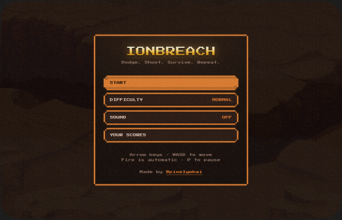
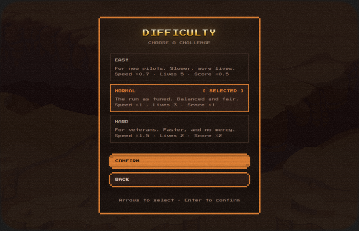
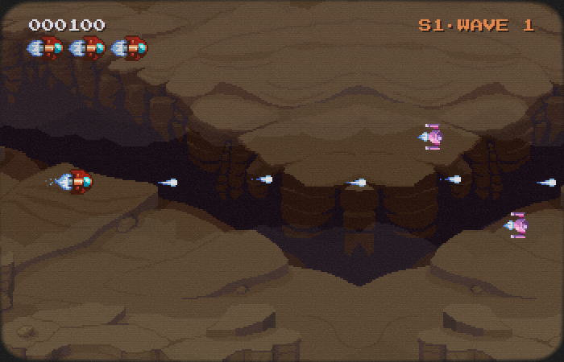
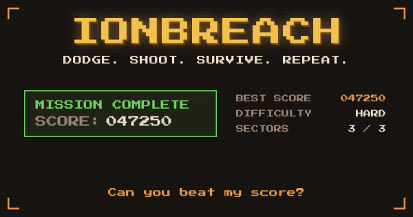
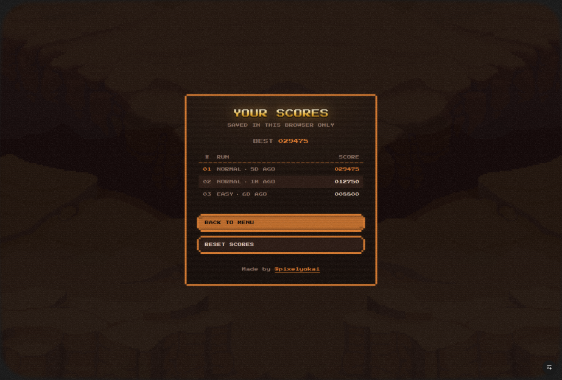

# Ionbreach

A side-scrolling shooter that runs in the browser. Three sectors, a boss at the end of
each, no continues. It takes about ten minutes to finish if you are good at it.

Play it: hold the left third of the screen, keep moving, shoot everything.



## Running it

```bash
npm install
npm run dev     # http://localhost:5173
npm run build   # static files into dist/
npm run test    # headless test pass, dev server must be running
```

## What is in it

Three sectors, each with its own terrain and its own boss: Dust Line, Riverrun, Nebula.
Beat a boss and you fly straight into the next sector with your score intact. Beat the
last one and you win.

Three difficulty settings. They are not cosmetic:

| | Enemy speed | Enemy fire rate | Lives | Score |
| --- | --- | --- | --- | --- |
| Easy | ×0.7 | slower | 5 | ×0.5 |
| Normal | ×1 | normal | 3 | ×1 |
| Hard | ×1.5 | faster | 2 | ×2 |

An enemy reads the setting when it spawns, not every frame. Changing difficulty in the
middle of a run would otherwise retune ships that are already on screen. A run also
records the difficulty it started on, so you cannot finish on Easy and have it scored as
Hard.



Your last ten runs are kept, ranked by score, with a reset button. Everything is in your
own browser. There is no account and no leaderboard.

## How it is built

The game is plain JavaScript drawing to a Canvas 2D context. No engine, no framework, no
game loop library. The menus are React, and that is the only thing React does here. The
two sides talk through one small file (`src/ui/bridge.js`) that can say "show this panel"
and "hide it". The game never touches React state and React never reads the game.

Menus use [8bitcn](https://www.8bitcn.com/) on its dungeon torch theme. The component set
is copied into `src/ui/components.jsx` rather than installed, which is how shadcn-style
libraries are meant to be used. Type never goes below 13px. Press Start 2P has no
lowercase and a tall x-height, and below 13px the glyph edges stop landing on whole
pixels.

The play field resizes with the window instead of sitting at a fixed 320x240. The sprite
scale is locked to a whole number, so a wider monitor gives you more field rather than
bigger pixels, and nothing ever gets resampled. The field is capped at 272px tall because
that is how tall the terrain art is.

Over the top of all that is a CRT effect: scanlines, a rolling bar, a soft bloom, and
animated grain. It is all CSS layers above the canvas, so none of it touches the pixels
the game draws.



## Layout

```
api/            two edge functions, for share cards
docs/           the original spec and screenshots
public/         favicons, the default OG image, the font satori needs
tools/          asset builds and the test runner
src/
  main.js       boots the shell and the router
  core/         loop, input, canvas, audio, sprites, particles, collision,
                pooling, storage, run log, router, cartridge contract
  shell/        the CRT layers
  ui/           React menus
  games/ionbreach/  the game itself
```

Game art is imported through Vite and never put in `public/`. Some of the source packs do
not allow you to redistribute the raw files, and a browsable asset folder is exactly that.
The favicons and the share card font are the exception, because a crawler has to be able
to fetch them at a fixed path.

## Adding a sector

Sectors are data. `src/games/ionbreach/data/levels.js` holds the list, and the spawner,
background, HUD and boss all read from it.

```js
{ id, name, terrain, scrim, waves, boss }
```

1. Write the waves in `data/waves.js`. A wave is `{ gapAfter, spawns: [{ type, at, y }] }`,
   where `at` is seconds into the wave and `y` is a fraction of the field height. Make it
   harder by mixing enemy types and tightening the spacing, not by scaling numbers up.
2. Add a terrain plate in `tools/ionbreach/build-assets.js` and declare it in
   `render/sprites.js`. Plates only need to tile vertically. The background mirror-tiles
   them sideways, so the art keeps the orientation it was drawn in.
3. Add a boss to `BOSS_DEFS` in the same build script. It composites stock parts into a
   silhouette, scales it up, recolours it and works out the damage states from there. Then
   give it health and attack phases in `BOSSES` in `entities/boss.js`.

Bosses should read apart by shape first and colour second. Three orange blobs of different
sizes is not three bosses.

## Asset builds

These are one-off. The output is committed, so you do not need to run them to work on the
game.

```bash
npm run assets:ionbreach     # sprites, terrain, bosses, audio
npm run assets:shell         # the CRT corner frame
npm run assets:brand         # favicons and the default OG image
node tools/preview-card.mjs  # renders both share cards into shots/
```

The favicon is the ship's 16x16 hull, not the whole 24x16 sprite. The sprite includes a
thruster flame that turns into a smudge at 32px. Everything is built at a 16px base and
scaled by whole numbers, so no icon is ever resampled.

## Sharing a run

The share button posts to X with a card showing that run's score, sector and difficulty.



This needs a server. X fetches whatever URL you share, reads the meta tags, and does not
run any JavaScript, so a card with your score on it cannot come from a static file. Two
edge functions handle it:

- `/s?o=won&s=47250&k=3&d=hard&b=47250` is the page X reads. Meta tags, then a script that
  sends a person on to the game.
- `/api/og?...` draws the card with `@vercel/og`.

`/s` forwards people with a script instead of an HTTP redirect on purpose. A crawler does
not run scripts, so a redirect would hand it the game's generic card instead of your run.

The card layout is in `api/_card.js`, kept apart from the endpoint so
`node tools/preview-card.mjs` can render both versions locally. A card you can only see
after deploying is a card nobody looks at. Satori is not a browser: flexbox and text, no
filters, no `background-clip`, no pseudo-elements, and anything with more than one child
needs `display: flex` spelled out.

Anyone can call these endpoints with anything, so every parameter is clamped or mapped to a
known value. The worst a hand-written URL gets you is a dull card.

## Saved data

Scores live in `localStorage` under the `ionbreach.` prefix: `best`, `runlog.ionbreach`,
`difficulty`, `muted`. No cookies, nothing sent anywhere, nothing shared between devices.
Your Scores has a reset button, so clearing it does not mean opening devtools.

Sound starts off. A page that makes noise the moment it loads is a page people close.

## Security

Everything is same-origin. The font is self-hosted, every asset is bundled, and the page
makes no outside requests. The built HTML carries a content security policy whose default
is `none`, generated in `vite.config.js`. It is applied to the build only, because the dev
server needs inline scripts and a websocket for hot reload, and a policy you have to loosen
for dev is not the policy you want to ship.

`frame-ancestors` is ignored inside a meta tag, so `vercel.json` sends it as a header along
with `X-Content-Type-Options`, `Referrer-Policy` and `X-Frame-Options`.

There is no server, no account and no score submission, so the only attack surface is your
own browser storage. `localStorage` is editable by anyone sitting at the machine, so the
run log is treated as untrusted input. `core/runlog.js` shape-checks and clamps everything
it reads back and `RunLog` clamps how wide a score can render. Editing a score by hand
changes your own personal best and nothing else.

`npm audit` flags a moderate issue in `fflate`, pulled in by `@vercel/og` through `satori`.
The affected code path is `unzipSync` on a broken archive. The only font this project hands
to satori is its own TTF from its own origin, and no query parameter reaches that code.
There is no fix that does not mean downgrading `@vercel/og`.

## Size

| | transferred |
| --- | --- |
| Title screen, sound off | 229 kB |
| Once you turn sound on | 1.8 MB |

The music track is nearly all of that second number. It has `preload="none"` until it is
both wanted and unmuted, so someone who never turns sound on never downloads it.

The built app is about 3.2 MB, and 2.4 MB of that is the music in two formats. The mp3 is
a Safari fallback that no other browser fetches.

## Tests

```bash
npm run dev                    # one terminal
node tools/smoke.mjs ./shots   # another
```

It drives a real browser through the title screen, the menus, a run, a 404, and then
mounts and unmounts the game five times while counting event listeners, animation frames
and audio players. That last part is the bug this kind of architecture actually gets:
leaking a listener every time you navigate.

Three checks worth calling out:

- Picking Hard and pressing Start is checked all the way down to `lives === 2` and
  `speedScale === 1.5` in the live session. A settings screen that looks right and changes
  nothing is the failure that matters.
- The campaign section walks all three sectors through dev hooks. Reaching sector 3 by hand
  is twenty minutes of play.
- Teardown ends by calling a dev-only `unmount()` hook, because there is one route and it
  falls back to itself. Without that there is no way to reach an unmounted state, and a
  check that cannot reach zero proves nothing.

35 checks, all passing.



## Credits

- Art and music by [Ansimuz](https://ansimuz.itch.io/spaceship-shooter-environment), CC0
- Sound effects by [Kenney](https://kenney.nl/assets/sci-fi-sounds), CC0
- UI components and the dungeon torch theme from [8bitcn](https://www.8bitcn.com/), MIT
- Press Start 2P by CodeMan38, SIL Open Font License 1.1

Built by [@pixelyokai](https://x.com/pixelyokai).
